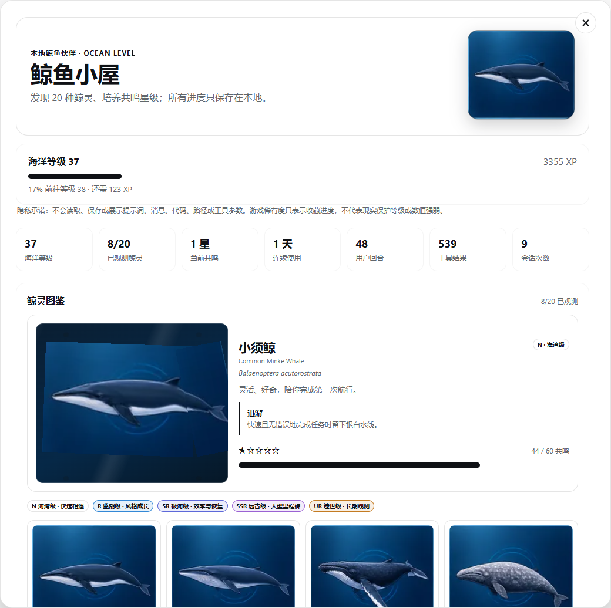
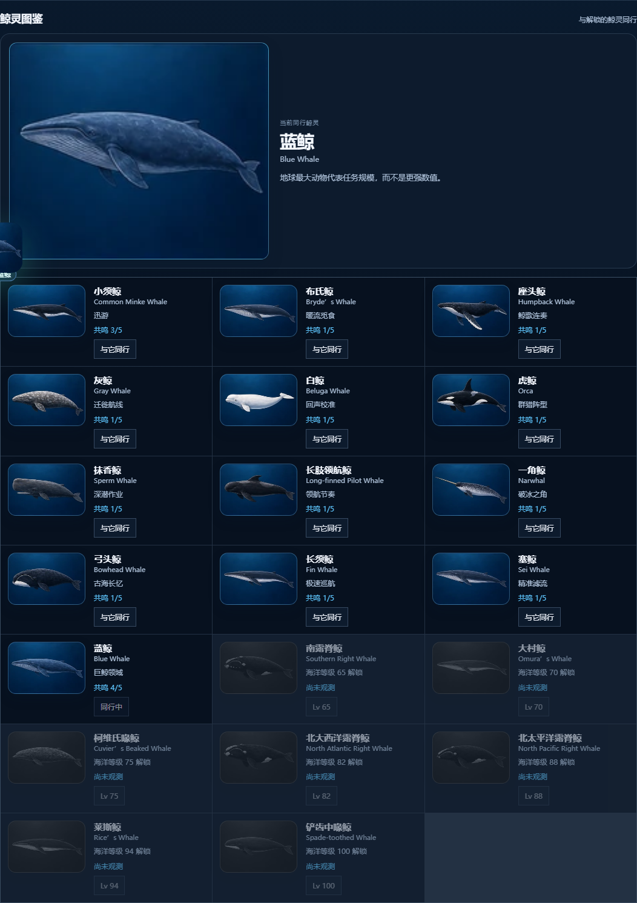
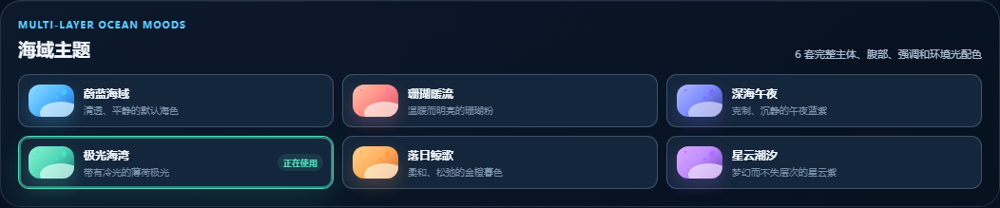

# dsh-whale-companion

English | [中文](README.zh-CN.md)

A local-first DSH whale world. Privacy-safe session metadata becomes a draggable companion, 20 unlockable whale spirits, visible tides, a personal sea cove, gentle expeditions, and opt-in local whale-circle cards.

## Screenshots

| Whale Home | Whale atlas |
| --- | --- |
|  |  |



> Unedited captures from a live local DSH Web session. Progress reflects that session; appearance follows the active DSH theme and viewport.

## Features

- **Complete 2.2.0 delivery:** named companion, four adaptive voyage goals, an animated self-contained SVG whale, a compact quick card, XP feedback, six multi-layer palettes, and local PNG/text sharing.
- Session dates now prefer the real creation timestamp; late historical events cannot roll streaks backward; every text import is capped at 512 KiB before JSON parsing; durable writes are fully schema-validated.
- CI now mounts the actual built client bundle in a browser-compatible DSH slot/Remote harness and runs desktop, mobile, light-theme, and reduced-motion Playwright visual regression.
- A movable `shell.overlay` whale supports pointer drag, keyboard movement, edge snapping, persisted viewport-safe placement, and one shared five-second local refresh. New tide moments appear in a bounded visible bubble; only milestones are announced to screen readers.
- Quiet, standard, and lively presentation modes stay in browser-local preferences. System reduced-motion always wins, and storage denial falls back safely without affecting progress.
- Whale Home now leads with a seven-day ocean journal, the current whale story beat, a visual cove preview, and a field-backed Privacy Ledger.
- 20 whale spirits unlock over Ocean Levels 1–100. Each maps its story and visible tide response to a safe event family, without changing model behavior.
- Live-only `session/created`, `user/message`, and `tool/result` metadata drives bounded local tide moments. Repeated tool results still count toward legacy XP, but cannot farm tide moments, collectibles, or expedition progress.
- The Whale Home provides a tide timeline, local SVG postcard export, a 24-item collectible catalog, eight fixed room slots, three room presets, and a non-punitive expedition.
- Visitor bottles are isolated read-only room previews. They do not merge or overwrite the receiver's progress.
- Whale-circle cards are opt-in and local-file based. They exchange only a preset alias, species, skin, coarse activity buckets, and resonance stars. There is no account, networking, ranking, free text, prompt excerpt, task name, or tool data.
- Six sea skins, all 12 achievements, responsive layouts, keyboard controls, focus handling, and reduced-motion rendering are included.

Turns grant 10 XP, tool results grant 5 XP, and session starts grant 20 XP. Only `user/message` counts as a turn. Levels derive from XP, and streaks use UTC session-start dates. Missing days never remove progress or collectibles.

## Privacy

The Host reads only session id, event sequence, event type, and timestamp. It never reads, stores, exports, or renders prompt text, assistant output, code, paths, tool arguments, or tool results.

New in-memory receipt digests use an HMAC key that never leaves the Host process. The durable receipt window is capped at 4,096 records, so it prevents recent duplicate live delivery, not permanent replay across Host restarts. Backups intentionally contain no receipt digests, session ids, or event data. SVG postcards and community cards are generated locally and contain only the documented safe fields.

## Install

Install directly from GitHub into the DSH Web profile:

```powershell
dsh plugin --profile web add github:LeemanCheung/dsh-whale-companion
```

Restart the existing DSH Web process and refresh its page.

## Model Experience

This plugin adds no model prompt, tools, messages, token usage, or KV-cache content. It observes committed session event metadata on the Host and exposes browser UI only.

## Known limitations

Progress lives in one DSH storage backend and does not synchronize across devices. The overlay polls every five seconds because the current host Remote event allowlist has no package-local whale-state push route. Whale-circle cards are intentionally local import/export only; a hosted community requires a separately owned, authenticated, and moderated transport provider.

## Development

From the repository root run:

```powershell
corepack pnpm typecheck
corepack pnpm test
corepack pnpm build
corepack pnpm pack:check
```

MIT. See [LICENSE](LICENSE).
