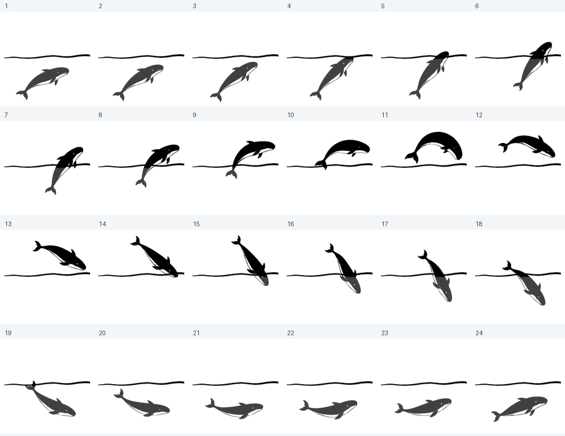

# 白腹墨鲸跃水

2026-09-05，替换此前未获用户认可的横向游动方案。风格参考用户提供的黑色跃水鲸及原始 Dive/Classic 动画：黑白轮廓、清楚的白腹、长尾和身体弯曲，不采用蓝色卡通鲸，也不直接复制品牌标志。

## 原画与动作

全部角色原画使用内置 ImageGen 生成。完整实际提示词在 [prompts.json](../artwork-sources/breach-v3/prompts.json)。四次生成依次为角色母图、带水线动作指导、独立身体姿态、两张顶点动作修正。参考图只用于造型和动作指导，不作为生成结果冒充原画。

运行时选择姿态表中的22张及两张修正版，共24张绘图。对齐后加入72张光栅距离场过渡帧，分开处理轨迹与身体变化，合成96帧、320×320、40fps、2.4秒循环。水线从生成的母图中裁取，不是程序画线。没有SVG或程序绘制的鲸鱼路径；生成图的白腹和眼睛转为透明留白。

原始状态插件仍只保留 Dive/Classic，不增加此前拒绝的 Sonar/Work/Compose/Idle/Alert。此资产用于小屋的小须鲸，其他物种及已选物种不强行切换。

## 可复查的质量检查

- `pnpm verify:breach:rebuild`：原图哈希、裁切及变换记录、96张不同帧、每帧25ms、四周至少4px透明边界、重建像素最多1级跨平台舍入差；发布文件自身哈希严格一致。
- `pnpm verify:ink:playback`：客户端嵌入确切WebP及同源PNG，画布与播放时序一致。
- 浏览器检查100、170、240px，浅深背景，跃出/弯身/入水和循环衔接。静帧使用第33帧，避免停止时只看到水下轮廓。
- 系统及插件减少动画时使用PNG；名片/明信片使用相同生成美术。现有名字、等级、皮肤及进度不变。

审阅是助手对可交付版本的检查，不代表用户已经认可新风格。大尺寸下距离场过渡仍可能有细微轮廓变化；24张原画与72张补帧在此明确区分。GIF仅供预览，准确速度以原生WebP为准。

